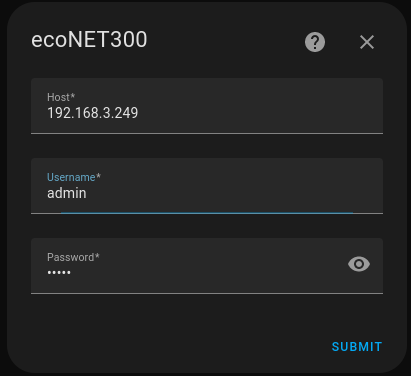
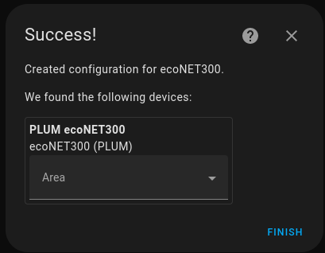

# ecoNET300 Home Assistant integration
<div align="center">

| Home Assistant  | ecoNET300     |
| --------------- | ------------- |
|                 |               |

</div>


## Overview
ecoNET300 Home Assistant is a custom integration for ecoNET300 devices. 

It works locally, which means it connects directly to your local device using local IP address. It doesn't forward commands/requests through econet24.com. It uses rest api exposed by ecoNET300 device.
<div align="center">

</div>

This integration is available from the Lovelace frontend without the need to configure the devices in the file configuration.yaml

Integration tested with ecoMAX controller ecoMAX810P-L TOUCH manufactured by [Plum Sp. z o.o.](https://www.plum.pl/)

**Bear in mind that the project is in a very early, pre-alpha phase.**

## versions
* v0.3.3 - version is stable. Most of the work was done by @pblxpt, for which we're very thankful as the community.
* v1.0.0_beta - is a new dev integration version that fetches more data from API, I don't know yet if it will be better or worse :). It's my first work.


## Example
Here is an example setup showing econet300 device entities:

<div align="center">


|                 |               |

</div>

## HACS Installation ##
Follow [this guide](https://hacs.xyz/docs/faq/custom_repositories/) to add ecoNET-300-Home-Assistant-Integration as a custom repository to the HACS.
Use this url as a repo: 
```
https://github.com/pblxptr/ecoNET-300-Home-Assistant-Integration
```

## Manual Installation
Copy the  `custom_components` folder your configuration directory.
It should look similar to this:
```
<config directory>/
|-- custom_components/
|   |-- econet300/
|       |-- [...]
```

## Configuration

Adding ecoNET300 integration to your Home Assistant instance can be done via user interface, by using this My button:


[](https://my.home-assistant.io/redirect/config_flow_start?domain=econet300)
<details>
  <summary><b>Manual Configuration Steps</b></summary>
  
Apart from using 'My button' (in case it doesn't work) you can also perform the following steps manually:

1. Browse to your Home Assistant instance.
2. In the sidebar click on Settings.
3. From the configuration menu select: Devices & Services.
4. In the bottom right, click on the Add Integration button.
5. From the list, search and select "ecoNET300".


6. Enter your connection details and click `Submit`.  

__Host__: Local IP/domain of your device.  

__Username__: Local username (NOT the username that you use to login to econet24.com!).

__Password__: Local password (NOT the password that you use to login to econet24.com!).



7. Your device should now be available in your Home Assistant installation.


  
</details>
<br>

## Entities
### Sensors
- Fan power (fanPower)
- Feeder temperature (tempFeeder)
- Exhaust (tempFlueGas)
- Fireplace temperature (tempCO)
- Fireplace set temperature (tempCOSet)
- Feeder temperature (tempFeeder)
- Water back temperature (tempBack)
- Water temperature (tempCWU)
- Outside temperature (tempExternalSensor)
- Fuel level (fuelLevel)
- Mixer 1 set temperature (mixerSetTemp1)
- Oxygen set level (lambdaSet)
- Oxygen level (lambdaLevel)

### Binary sensors
- Water pump (pumpCWUWorks)
- Fireplace pump (pumpFireplaceWorks)
- Circulation pump (pumpCirculationWorks)
- Solar pump (pumpSolarWorks)
- Fireplace pump (pumpCOWorks)
- Lighter (lighterWorks)
- Fan (fanWorks)
- Feeder (fanWorks)

## Contribution

I work on this project only in my very-limited free time. At this moment I have opened a few other projects which are on a bit higher priority than this one, but I'm going to work on this quite regularlly as I use it in my home automation. However, if you want to help and contribute to this project **it will be highly appreciated.**

Also if you see a need for a particular feature, don't hesitate to let me know.

---
## DISCLAIMER
**I AM NOT RESPONSIBLE FOR ANY USE OR DAMAGE THIS SOFTWARE MAY CAUSE. THIS IS INTENDED FOR EDUCATIONAL PURPOSES ONLY. USE AT YOUR OWN RISK.**
